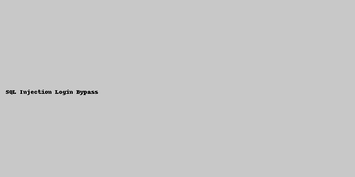

# Security Testing Report – DVWA

## 1. Introduction

This document outlines the steps taken to test DVWA for SQL Injection and Cross-Site Scripting (XSS) vulnerabilities.

## 2. SQL Injection

- **Location**: Login Page
- **Payload**: `' OR '1'='1`
- **Impact**: Bypasses login authentication
- **Mitigation**:
  - Use prepared statements
  - Validate and sanitize input

## 3. Cross-Site Scripting (XSS)

- **Location**: Guestbook Comments
- **Payload**: ``
- **Impact**: JavaScript code execution in user browser
- **Mitigation**:
  - Output encoding
  - Content-Security-Policy header
  - Input sanitization

## 4. Screenshots

